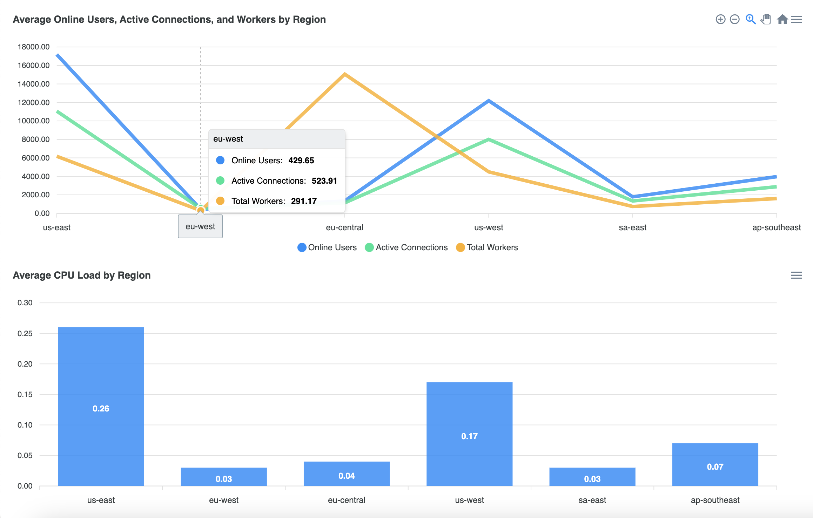
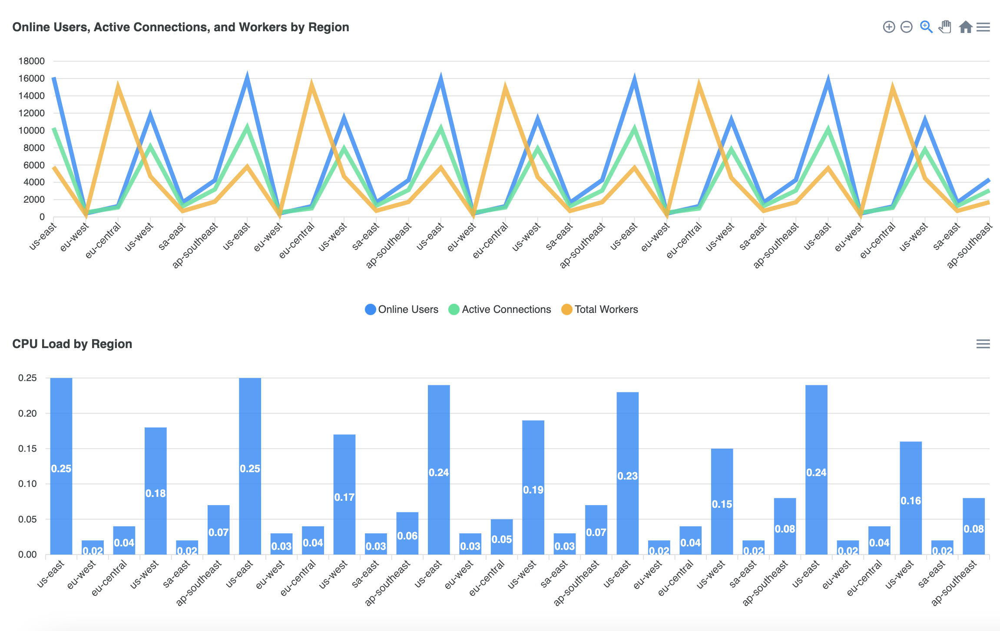

# Real-Time Server Monitoring Dashboard

## Overview

This project provides a real-time dashboard to monitor server status and statistics across various regions using a React frontend and a Node.js backend. Data is fetched periodically from multiple regions and displayed on the client using charts.

<!-- Add an image -->

### Average



### Total



## Table of Contents

- [Setup and Installation](#setup-and-installation)
- [Backend (Server)](#backend-server)
  - [Overview](#overview)
  - [API Endpoints](#api-endpoints)
  - [Scheduled Jobs](#scheduled-jobs)
  - [WebSocket Integration](#websocket-integration)
- [Frontend (Client)](#frontend-server)
  - [Overview](#overview)
  - [Components](#components)
  - [WebSocket Integration](#websocket-integration)
- [Running the Project](#running-the-project)
- [Acknowledgments](#acknowledgments)
- [Author](#author)

## Setup and Installation

### Prerequisites

- **Node.js** (v14 or above)
- **npm** (v6 or above)
- **Vite** (for React client development)

### Installation

1. **Clone the repository:**

   ```bash
   git clone https://github.com/yourusername/your-repo.git
   cd your-repo
   ```

2. **Install dependencies for the server:**

   ```bash
   cd server
   npm install
   ```

3. **Install dependencies for the client:**

   ```bash
   cd client
   npm install
   ```

## Backend (Server)

### Overview

The server is built using Node.js with Express, and it utilizes LowDB for lightweight data storage. It periodically fetches data from various regions and serves this data to the client via REST API and WebSocket.

### API Endpoints

- **GET `/api/data`**

  Fetches the data stored in the LowDB database. If a `region` query parameter is provided, it returns data for that specific region; otherwise, it returns all data from the past week.

  **Query Parameters:**

  - `region` (optional): The region for which to fetch data.

  **Response:**

  ```json
  [
    {
      "region": "us-east",
      "data": {
        "status": "ok",
        "results": { ... }
      },
      "timestamp": "2024-08-20T19:57:15.507Z"
    },
    ...
  ]
  ```

### Scheduled Jobs

- **Job: Data Fetching**

  Runs every minute to fetch data from the configured regions and store it in LowDB. This data is then broadcast to all connected WebSocket clients.

  **Configuration:**

  - Regions are configured in the `fetchData.ts` file.
  - The job uses `node-cron` for scheduling.

### WebSocket Integration

- **Broadcasting Data:**

  The server uses `socket.io` to establish WebSocket connections. After each data fetch, the new data is broadcasted to all connected clients.

  - **Event:** `dataUpdate`
  - **Payload:** Array of new data entries

  When a client connects, the server also sends the initial data to the client:

  - **Event:** `initialData`
  - **Payload:** Array of all data from the past week

## Frontend (Client)

### Overview

The client is built using React and Vite. It connects to the backend via both REST API and WebSocket to receive real-time updates and displays the data using charts (ApexCharts).

### Components

- **DataDisplayComponent:**

  This component is responsible for displaying the data fetched from the server. It uses `LineChart` and `BarChart` components to visualize different metrics.

- **LineChart:**

  Displays data trends over time for metrics like online users, active connections, and workers.

- **BarChart:**

  Visualizes average CPU load per region.

### WebSocket Integration

- **Connect to WebSocket:**

  On component mount, the client connects to the server using `socket.io-client`. It listens for the `initialData` event to load initial data and the `dataUpdate` event for real-time updates.

  - **Initial Data Handling:** The initial data is received via the `initialData` event when the WebSocket connection is first established.
  - **Data Update Handling:** Real-time data updates are received via the `dataUpdate` event and merged with the existing state.

### Data Parsing and Validation

- **DataParser:**

  The `DataParser` class handles parsing and filtering of the data received from the server, including:

  - Removing entries older than one week
  - Calculating averages for metrics per region

- **Data Validation:**

  Validation is performed using `yup` schemas to ensure the integrity of the data received from the server.

## Running the Project

### Running the Server

1. **Start the server:**

   ```bash
   cd server
   npm run build
   npm run start
   ```

This will build the project and start the server on http://localhost:3000.

2. **Check API and WebSocket:**

- Initial API check http://localhost:3000.
- Data is accessible at http://localhost:3000/api/data (fetched every minute).
- WebSocket connection is established at http://localhost:3000 (from the client app).

### Running the Client

1. **Start the client:**

   ```bash
   cd client
   npm run dev
   ```

The client will start on http://localhost:5173.

2. **Access the Dashboard:**

- Open http://localhost:5173 in your browser to view the dashboard. Data will be fetched and added to the dashboard.

## Acknowledgments

- **React** for building the client-side UI.
- **Express** for the server-side logic.
- **LowDB** for lightweight data storage.
- **ApexCharts** for data visualization.
- **socket.io** for enabling real-time communication between the client and server.

## Author

Erke Canbazoğlu

- Linkedin - [Erke Canbazoğlu](https://www.linkedin.com/in/erkecanbazoglu/)
- Github - [erkecanbazoglu](https://github.com/erkecanbazoglu)
